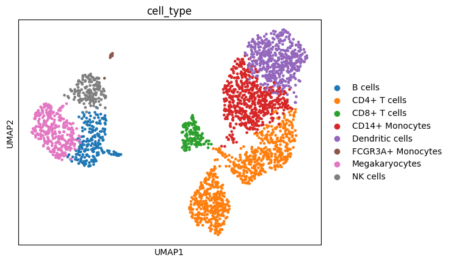

# scRNA-seq Analysis Pipeline

An end-to-end single-cell RNA sequencing (scRNA-seq) analysis pipeline built in Python using Scanpy and AnnData, applied to the 10x Genomics PBMC 3k dataset.

The pipeline covers every major step of a standard scRNA-seq workflow: quality control, normalisation, dimensionality reduction, graph-based clustering, and marker-based cell type annotation. It is structured as a modular Python package where each analytical step is independently testable and documented.

---

## Results



*Final annotated UMAP showing 8 distinct PBMC cell populations identified from 2,693 cells.*

---

## Pipeline Overview

```
Raw Data (2,700 cells × 32,738 genes)
        ↓
Quality Control       → removes empty droplets, doublets, dying cells
        ↓
Normalisation         → corrects for sequencing depth differences
Log Transformation    → compresses wide dynamic range
HVG Selection         → retains 2,000 most informative genes
        ↓
PCA                   → reduces to 50 principal components
kNN Graph             → connects each cell to its 10 nearest neighbours
UMAP                  → projects to 2D for visualisation
        ↓
Leiden Clustering     → identifies 9 cell communities
        ↓
Annotation            → maps clusters to known PBMC cell types
```

---

## Project Structure

```
scRNA-seq_pipeline/
├── src/
│   └── scrna_pipeline/
│       ├── __init__.py
│       ├── data_loading.py     # Download and load the PBMC dataset
│       ├── qc.py               # Quality control filtering
│       ├── preprocessing.py    # Normalisation and feature selection
│       ├── dimensionality.py   # PCA, kNN graph, UMAP
│       ├── clustering.py       # Leiden graph-based clustering
│       └── annotation.py      # Marker gene identification and annotation
├── data/
│   ├── raw/                   # Raw data (gitignored)
│   └── processed/             # Processed AnnData objects (gitignored)
├── results/
│   └── figures/               # Output plots
├── docs/
├── requirements.txt
└── README.md
```

---

## Quickstart

### 1. Clone the repository

```bash
git clone https://github.com/ryadl14/scRNA-seq_pipeline.git
cd scRNA-seq_pipeline
```

### 2. Create and activate a virtual environment

```bash
python -m venv venv

# Mac/Linux
source venv/bin/activate

# Windows (Git Bash)
source venv/Scripts/activate
```

### 3. Install dependencies

```bash
pip install -r requirements.txt
```

### 4. Run the full pipeline

Each module can be run in isolation for testing:

```bash
python -m src.scrna_pipeline.data_loading
python -m src.scrna_pipeline.qc
python -m src.scrna_pipeline.preprocessing
python -m src.scrna_pipeline.dimensionality
python -m src.scrna_pipeline.clustering
python -m src.scrna_pipeline.annotation
```

The dataset is downloaded automatically from Scanpy's data repository on first run.

---

## Module Documentation

### `data_loading.py`
Downloads the 10x Genomics PBMC 3k dataset and loads it into an AnnData object. Preserves a copy of the raw counts in `adata.raw` before any transformations are applied.

### `qc.py`
Filters out three types of low-quality observations specific to droplet-based scRNA-seq:

| Issue | Signal | Threshold |
|---|---|---|
| Empty droplets | Too few genes detected | `min_genes = 200` |
| Doublets | Too many genes detected | `max_genes = 2500` |
| Dying/damaged cells | High mitochondrial read % | `max_pct_mt = 20%` |

Genes detected in fewer than 3 cells are also removed. Violin plots are saved to `results/figures/` to allow threshold inspection before filtering.

### `preprocessing.py`
Three sequential steps:
- **Normalisation** — scales each cell to 10,000 total counts, correcting for sequencing depth differences
- **Log transformation** — applies log1p to compress the wide dynamic range of gene expression values
- **HVG selection** — flags the top 2,000 highly variable genes for use in PCA, without removing the rest

### `dimensionality.py`
- **PCA** — computed on the 2,000 HVGs across 50 principal components. An elbow plot is saved to guide selection of the optimal number of PCs.
- **kNN graph** — built in PCA space using the top 10 PCs and k=10 neighbours per cell
- **UMAP** — projects the kNN graph to 2D for visualisation. UMAP coordinates are for visualisation only — all quantitative analysis uses PCA space.

### `clustering.py`
Runs the Leiden community detection algorithm on the kNN graph with `resolution=0.5`, `n_iterations=2`, and `directed=False` (required by the igraph backend). Produces a UMAP coloured by cluster number.

### `annotation.py`
Identifies differentially expressed marker genes per cluster using the Wilcoxon rank-sum test, then maps clusters to known PBMC cell types using a default annotation dictionary:

| Cluster | Cell Type |
|---|---|
| 0 | CD4+ T cells |
| 1 | CD14+ Monocytes |
| 2 | CD4+ T cells |
| 3 | B cells |
| 4 | CD8+ T cells |
| 5 | NK cells |
| 6 | FCGR3A+ Monocytes |
| 7 | Dendritic cells |
| 8 | Megakaryocytes |

A custom annotation dictionary can be passed to `run_annotation()` to override the defaults.

---

## Key Parameters

| Parameter | Value | Rationale |
|---|---|---|
| `min_genes` | 200 | Lower bound for real cells vs empty droplets |
| `max_genes` | 2500 | Upper bound proxy for doublet detection |
| `max_pct_mt` | 20% | Mitochondrial threshold for dying cell removal |
| `target_sum` | 10,000 | Standard CP10K normalisation |
| `n_top_genes` | 2000 | HVGs for PBMC dataset of this size |
| `n_comps` | 50 | PCs computed; top 10 used downstream |
| `n_pcs` | 10 | Chosen from elbow plot |
| `n_neighbors` | 10 | kNN graph for ~2,700 cells |
| `resolution` | 0.5 | Leiden resolution for major PBMC populations |

---

## Requirements

```
scanpy
leidenalg
python-igraph
matplotlib
seaborn
```

Install with: `pip install -r requirements.txt`

---

## Dataset

The PBMC 3k dataset consists of 2,700 peripheral blood mononuclear cells from a healthy donor, sequenced on the 10x Chromium v1 platform. It is publicly available and widely used as a benchmark dataset for scRNA-seq analysis tools.

After QC filtering, 2,693 cells and 13,673 genes are retained for analysis.

---

## Author

Ryad Lachemi — [github.com/ryadl14](https://github.com/ryadl14)
